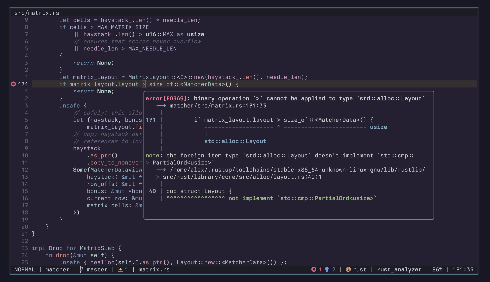

<div align="center" style="color: #abb2bf;font-family: 'Fira Code', monospace;">

# krust.nvim

[](https://neovim.io/)


**🦀 Nicer Rust diagnostics for Neovim.**



</div>

## Why?

To be able to read complete Rust compiler diagnostics in Neovim with proper colors and formatting, similar to how they appear when running cargo in the terminal.

## Installation

### [`lazy.nvim`](https://github.com/folke/lazy.nvim)

```lua
{
  "alexpasmantier/krust.nvim",
  ft = "rust",
}
```

### [`packer.nvim`](https://github.com/wbthomason/packer.nvim)

```lua
use {
  "alexpasmantier/krust.nvim",
  ft = "rust",
}
```

## Configuration

**Krust** automatically configures rust-analyzer to send colored diagnostics. No keybindings are set by default to avoid conflicts.

```lua
-- With lazy.nvim
{
  "alexpasmantier/krust.nvim",
  ft = "rust",
  opts = {
    keymap = "<leader>k",  -- Set a keymap for Rust buffers (default: false)
    float_win = {
      border = "rounded",    -- Border style: "none", "single", "double", "rounded", "solid", "shadow"
      auto_focus = false,    -- Auto-focus float (default: false)
    },
  },
}
```

**Note:** If rust-analyzer starts before krust.nvim loads, you may need `:LspRestart` for colors to appear. To avoid this, load `krust.nvim` before your LSP config.

## Usage

Use the command:

```vim
:Krust
```

Or call from Lua:

```lua
require('krust').render()
```

### Behavior

**Krust** tries to behave like LSP hover documentation windows:

- **First invocation**: Opens the floating window (not focused)
- **Second invocation**: Enters the floating window so you may scroll
- **`q` or `<Esc>`**: Closes the window

## Credits

This was inspired by [rustaceanvim](https://github.com/mrcjkb/rustaceanvim)'s diagnostic rendering.
